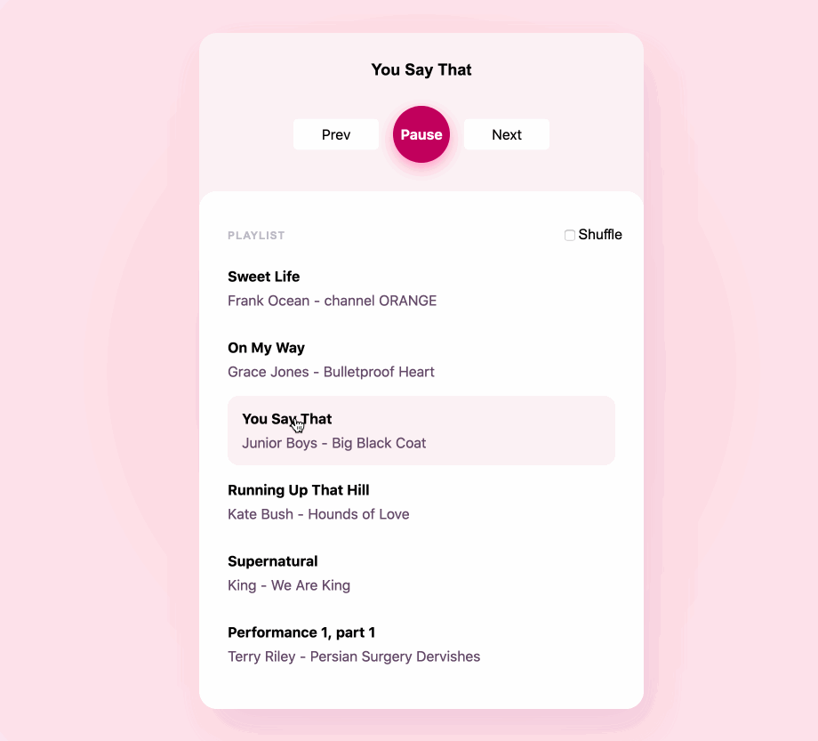

# Boundless take-home test - Music Player



The goal of this exercise is to create a music player in React.

## Provided Materials

The example playlist that can be used for development can be found at
`app/playlist.js`.

## Desired Results

You can consult the GIF above for an overview of the functionality required for this project.

### Functionality

1. Play songs from a playlist.
2. Display the currently playing song.
3. Pause and resume the currently playing song.
4. Go back to the previous song.
5. Skip to the next song in the playlist.
6. Shuffle the songs included in the playlist.

Here are a few specifics about some less obvious parts of this application:

- **Shuffle**: When toggled on, the player should play all the songs in random order before replaying any song.
- **Next**: If shuffle is toggled on, the `Next` button should start playing the next song in the randomized order. If shuffle is not toggled on, `Next` should start the next song in the playlist. When the last song is playing, `Next` should start again from the beginning.
- **Previous**: `Previous` button always plays the last song played before the currently playing song.

If you come across some corner cases that are not addressed here, please use your best judgement to decide on what should happen. What do you think would be the best user experience?

### Styling

Please include some styling with your solution. You can implement the same UI as the GIF above, or you can design your own, it's completely up to you. Want to add icons? Go for it. Custom fonts? Be our guest. We are looking for CSS proficiency and attention to detail.

We provided a CSS file in `styles/application.css` as a jumping-off point, but feel free to add more files or modify the Brunch configuration as much as you'd like.

## Testing

There are two tests you should modify before turning in:

- `test/foo_test.js` - this is a unit test example you can use
- `test/components/App_test.js` - this is an example of testing a React component with [Enzyme](https://enzymejs.github.io/enzyme/)

You can run the tests with `npm test`. If you want the test process to keep polling and run on save, use `mocha -w test`.

The following has been setup in the mocha test environment:

- mocha
- chai matchers
- jsdom
- enzyme
- babel-polyfill

As well, `app/` has been added to the runtime path, so you can do things like:

```js
import App from 'components/App'
```

inside your tests.

## Development

### Development server

The repository is ready to go with a [brunch](https://brunch.io/) configuration to build and serve a development version of the page with React.

We recommend using Node 13 for this project.

Run `npm install` to download the dependencies, and then `npm start` then open the browser to [http://localhost:3333](http://localhost:3333)

As currently configured, the starting point for brunch is at `app/assets/index.html`.

Please feel free to add any additional libraries or tools as you see fit. For example, [howler.js](https://github.com/goldfire/howler.js) can help you handle audio playback. If you make any changes to the build process that require different steps for viewing your solution, please document those steps clearly.

## Evaluation Criteria

- **Implementation considerations:** please include a discussion of the thinking you went through in designing your solution. We're eager to hear about your thought process! It will help us be on the same page with you when reviewing your solution.
- **Well-factored code:** readability, maintainability, and design concepts like single responsibility are important for us in addition to a functioning solution. Please employ good componentization practices and organize your components and files as you see fit.
- **Handling invalid input and error conditions**: make sure to handle important error conditions with helpful messages for the user about how to recover from these errors and use your program.
- **How do you manage application-wide state?**: please include a discussion of your thoughts around React state management and what your thought process was for this challenge.
- **Styling proficiency**: demonstrate your CSS skills and creativity.
- **Testing**: how will you test the application? Please include a discussion of your thought process around testing and what you chose to do for this app.

Code is often easier to write than it is to read. We appreciate the use of white space and clear variable and method names to help us understand your solution.

## Submitting your solution

Please take as much time as you would like to. Once you feel your solution is complete, zip up the file and return it via email to the person that sent it to you. If the file cannot be sent over email, upload it to a google drive and send us the link. Good luck and have fun!

## Questions

If you have any questions about this problem or about your interview process reach out to [code@boundless.com](mailto:code@boundless.com) or the Boundless engineer who sent you the repo.
